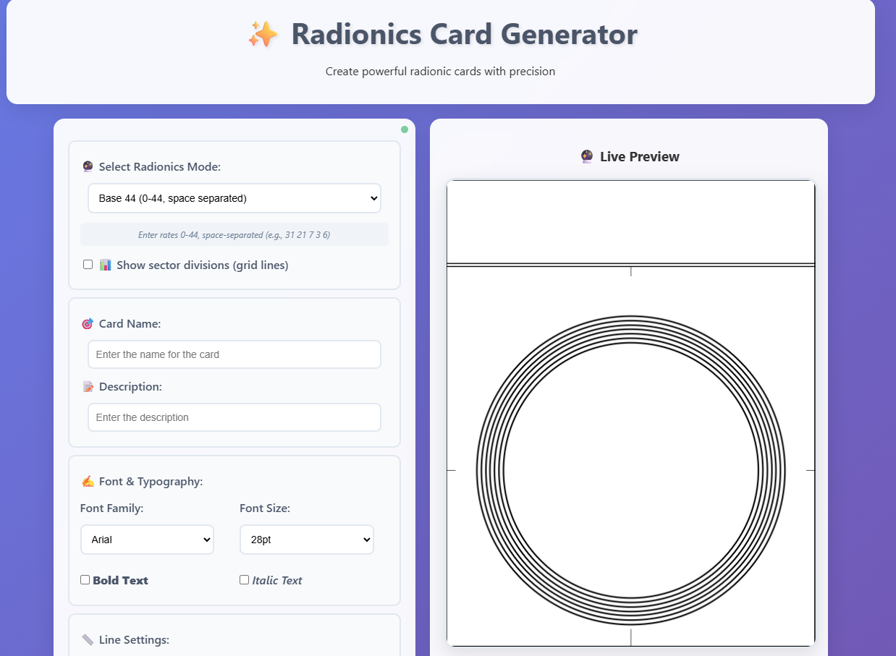

# Radionics Card Generator

## Overview
The Radionics Card Generator is a web-based application designed to create customizable radionic cards with precision. Users can select different radionics modes, customize card appearance (including font, line settings, and rates), and generate a live preview of the card. The application supports saving the card as a JPG, copying rates, and generating random rates for convenience.

## Features
- **Radionics Modes**: Supports Base 44, Base 336, Base 10, and Hieronymus modes with specific formatting rules for rate inputs.
- **Customizable Card Details**:
  - Card name (up to 50 characters).
  - Card description (up to 80 characters).
- **Typography Options**:
  - Choose from a variety of fonts (e.g., Arial, Times New Roman, Comic Sans MS, etc.).
  - Adjustable font sizes (8pt to 40pt).
  - Bold and italic text options.
- **Line Settings**:
  - Customizable line thickness (1px to 6px).
  - Adjustable inner line length (from Short to Nearly Full).
  - Outer line extension options (from no extension to 30px).
- **Sector Divisions**: Option to display grid lines for sector divisions.
- **Rate Input**: Enter radionic rates based on the selected mode, with real-time preview updates.
- **Additional Features**:
  - Upload a logo to display in the bottom-right corner.
  - Generate random rates.
  - Save the card as a JPG file.
  - Copy rates to clipboard.

## Usage
1. **Select Radionics Mode**: Choose from Base 44, Base 336, Base 10, or Hieronymus modes to define the rate format.
2. **Enter Card Details**:
   - Input a card name (e.g., "Healing Energy") and a brief description (e.g., "For general well-being").
3. **Customize Appearance**:
   - Select a font family and size.
   - Enable bold or italic text if desired.
   - Adjust line thickness, inner line length, and outer line extension.
   - Optionally enable sector divisions (grid lines).
4. **Input Rates**: Enter the radionic rates in the format required by the selected mode. The live preview updates automatically.
5. **Add Logo**: Upload a logo to display in the bottom-right corner of the card.
6. **Generate and Save**:
   - Use the "Random Rates" button to generate random rates.
   - Click "Save as JPG" to download the card as an image.
   - Use "Copy Rates" to copy the entered rates to the clipboard.
7. **Live Preview**: Monitor the card's appearance in real-time as you make changes.

## File Structure
- `radionics_card_generator.html`: The main HTML file containing the structure and UI elements for the application.

## Requirements
- A modern web browser (e.g., Chrome, Firefox, Edge) to run the application.
- No additional dependencies are required as the application is purely client-side.

## Installation
1. Download or clone the repository containing `radionics_card_generator.html`.
2. Open the `radionics_card_generator.html` file in a web browser to start using the application.

## Notes
- Ensure that the rates entered match the selected mode's format (e.g., space-separated for Base 44, no spaces for Base 336).
- The application is designed to be intuitive, with a live preview that updates as you modify settings.
- For optimal results, use high-resolution logos for the bottom-right corner.

## Limitations
- The application does not currently support server-side storage or cloud-based saving.
- The maximum character limits for card name (50) and description (80) are enforced to maintain card readability.

## Future Improvements
- Add support for additional radionics modes.
- Implement advanced image editing options (e.g., logo positioning, scaling).
- Include templates for common radionic card designs.

## License
This project is licensed under the MIT License. See the [LICENSE](LICENSE) file for details.

## Contact
For questions or support, please contact the developer at [support@x.ai](mailto:support@x.ai).
